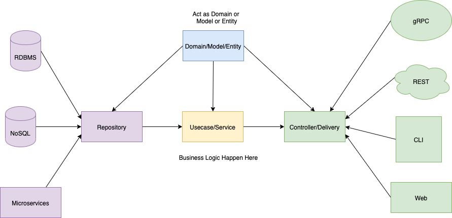

# Job Portal

## Description
Make API for Job Portal. All development use `git flow`.

## Prerequisite
  - Golang
  - Postgres
  - Git Flow
  -

## Architecture

source: https://medium.com/easyread/golang-clean-archithecture-efd6d7c43047


## Scopes
| Ticket ID | Ticket Title | User Story |
|---|---|---|
| PHASE I |
| JP-01 | User register | As a User, i can register as company or candidate |
| JP-02 | User login, refresh access token and logout | As a User, i can login as company or candidate, refresh access token and logout |
| [JP-03](readme.md#update-profil-company) | Update profil company | As a company, i can update my profil |
| [JP-04](readme.md#update-profil-candidate) | Update profil candidate | As a candidate, i can update my profil |
| [JP-05](readme.md#get-list-company) | Get list company | As a candidate, i can see list of company |
| [JP-06](readme.md#get-detail-company) | Get detail company | As a candidate, i can see detail of company |
| [JP-07](readme.md#review-company) | Review company | As a candidate, i can review company with rating |
| [JP-08](readme.md#get-list-review-company) | Get list review company | As a candidate, i can get list of all reviews of company |
| JP-09 | Get list company dresscode, benefits, and size | As a company, i can get list code dresscode, benefits and size |
| JP-10 | Integration Test case | Create integration test case for all API phase 1 |
| JP-11 | Unit Test case | Create unit test case for all API phase 1 |
| JP-12 | Embed Query SQL | Move all query to file sql with golang embed |
|---|---|---|
| PHASE II |


## Installation and Tests
use this command in root folder to test project:
```
  make test
```

run this project:
```
  go install
  make start
```

## Api Specs
See swagger in `docs/api-docs.yml` for documentation. Copy it and paste here https://editor.swagger.io/
